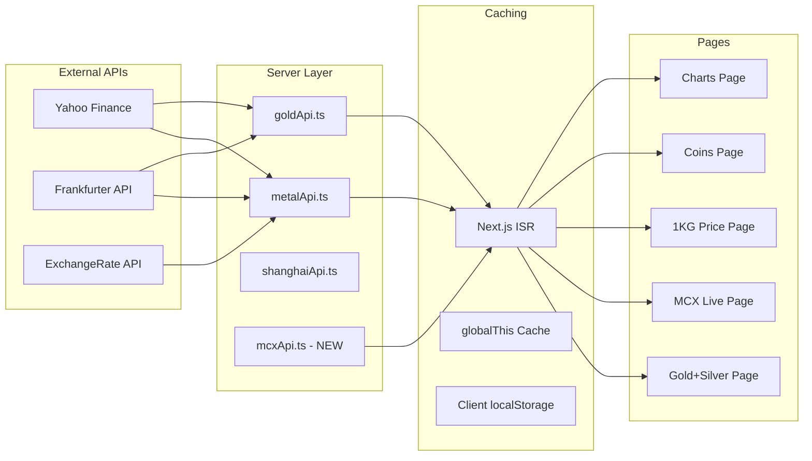
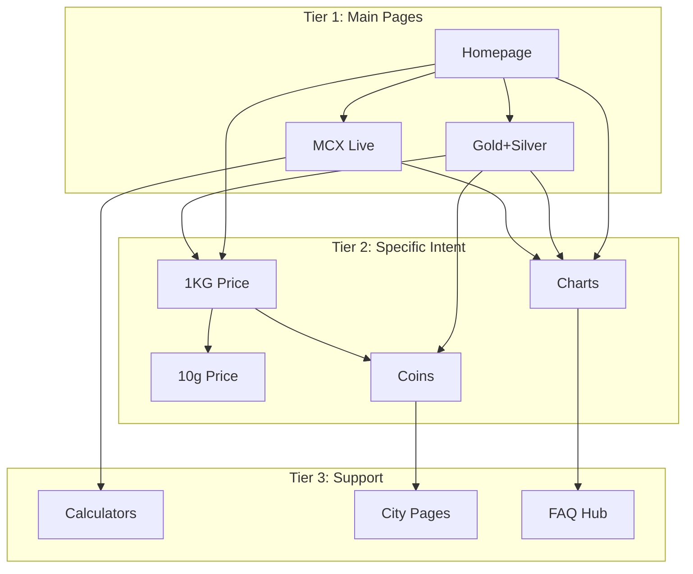

# SilverInfo.in 2026 Authority Platform - Master Implementation Plan

## Architecture Overview

```mermaid
flowchart TD
    subgraph core [HUB 1: Core Price Engine]
        HomePage[Homepage - Live Prices]
        SilverRate[/silver-rate-today]
    end
    
    subgraph weight [HUB 2: Weight Pages]
        OneKg[/1-kg-silver-price]
        TenGram[/10-gram-silver-price]
        OneTola[/1-tola-silver-price]
    end
    
    subgraph market [HUB 3: Market Authority]
        MCX[/mcx-silver-live]
        Futures[/silver-futures]
    end
    
    subgraph combined [HUB 4: Combined Metals]
        GoldSilver[/gold-and-silver-prices]
        Ratio[Gold-Silver Ratio Widget]
    end
    
    subgraph retail [HUB 5: Retail Intent]
        Coins[/silver-coin-prices]
        BuyGuide[/buy-silver-online]
    end
    
    subgraph history [HUB 6: Charts and History]
        Charts[/silver-price-chart]
        Historical[/historical-silver-prices]
    end
    
    HomePage --> weight
    HomePage --> market
    HomePage --> combined
    HomePage --> retail
    HomePage --> history
    
    GoldSilver --> Ratio
    MCX --> Futures
```

## Data Flow Architecture



---

## PHASE 1: Gold and Silver Combined Page (Week 1)

**Priority: HIGHEST** | **Keywords: 600K-6M searches/month**

### Target Keywords

- gold and silver prices today (100K-1M)
- current gold and silver prices (100K-1M)
- gold silver prices today (100K-1M)
- gold silver rate today (100K-1M)
- gold and silver rate today (100K-1M)
- value of gold and silver (10K-100K)
- gold price silver price (10K-100K)

### Files to Create

1. **[src/app/gold-and-silver-prices/page.tsx](silverinfo/src/app/gold-and-silver-prices/page.tsx)** - Main page
2. **[src/components/combined/GoldSilverRatioCard.tsx](silverinfo/src/components/combined/GoldSilverRatioCard.tsx)** - Gold-Silver Ratio widget
3. **[src/components/combined/CombinedPriceTable.tsx](silverinfo/src/components/combined/CombinedPriceTable.tsx)** - Side-by-side comparison

### Page Structure

```
H1: Gold and Silver Prices Today in India
├── Combined Price Cards (Gold + Silver side-by-side)
├── Gold-Silver Ratio Widget (IMPORTANT for SEO)
│   └── Current ratio, historical average, buy signals
├── Weight Comparison Table
│   └── 1g, 10g, 100g, 1kg, 1 tola for both metals
├── Price Change Analysis
│   └── 24h, 7d, 30d changes for both
├── Market Factors Section
│   └── COMEX Gold, COMEX Silver, USD/INR
├── Investment Comparison
│   └── Which to buy? Gold vs Silver pros/cons
├── Hindi Section (for chandi/sona keywords)
└── FAQ Schema (10 questions)
```

### API Integration

Reuse existing APIs:

- [src/lib/metalApi.ts](silverinfo/src/lib/metalApi.ts) - `getSilverPriceWithChange()`
- [src/lib/goldApi.ts](silverinfo/src/lib/goldApi.ts) - `getGoldPriceWithChange()`

New function to add in `metalApi.ts`:

```typescript
export function calculateGoldSilverRatio(goldPrice: number, silverPrice: number): number {
  // Gold price per oz / Silver price per oz
  return Math.round((goldPrice / silverPrice) * 100) / 100;
}
```

### SEO Requirements

- Title: "Gold and Silver Prices Today India | Live Rate per Gram (Updated)"
- Meta description targeting all combo keywords
- JSON-LD schemas: Product (x2), FAQPage, BreadcrumbList
- OpenGraph with gold+silver imagery
- Canonical: /gold-and-silver-prices

### Testing Checklist (Phase 1)

- [ ] Both gold and silver prices load correctly
- [ ] Gold-Silver ratio calculates accurately (should be ~80-90 in 2026)
- [ ] All weight conversions match homepage values
- [ ] Hindi section renders properly
- [ ] FAQ accordion works
- [ ] Mobile responsive
- [ ] No hydration errors
- [ ] Page speed < 3s LCP

---

## PHASE 2: MCX Silver Live Page (Week 2)

**Priority: CRITICAL** | **Keywords: 400K-4M searches/month**

### Target Keywords

- silver mcx (100K-1M)
- mcx silver live (100K-1M)
- mcx silver price (100K-1M)
- mcx silver rate (100K-1M)
- silver futures (10K-100K)
- silver futures price (10K-100K)
- silver futures live (10K-100K)

### Files to Create

1. **[src/app/mcx-silver-live/page.tsx](silverinfo/src/app/mcx-silver-live/page.tsx)** - Main MCX page
2. **[src/lib/mcxApi.ts](silverinfo/src/lib/mcxApi.ts)** - MCX-specific calculations
3. **[src/components/mcx/MCXPriceCard.tsx](silverinfo/src/components/mcx/MCXPriceCard.tsx)** - MCX price display
4. **[src/components/mcx/MCXvsSpotComparison.tsx](silverinfo/src/components/mcx/MCXvsSpotComparison.tsx)** - Educational widget
5. **[src/hooks/useLiveMCXPrice.ts](silverinfo/src/hooks/useLiveMCXPrice.ts)** - Client polling hook

### Page Structure

```
H1: MCX Silver Price Today | Live Silver Futures Rate
├── MCX Price Card (ABOVE FOLD)
│   └── Current MCX rate, lot size (30kg), margin %
├── MCX vs Spot Price Comparison
│   └── Why MCX differs from spot (8-12% premium)
├── Contract Specifications Table
│   └── Lot size, tick size, expiry dates
├── Trading Hours Widget
│   └── MCX: 9 AM - 11:30 PM IST
├── Futures vs Physical Silver
│   └── Educational content for authority
├── Live MCX Chart
├── MCX Silver Lots Calculator
├── Hindi Section (MCX chandi rate)
└── FAQ Schema (10 MCX-specific questions)
```

### MCX Price Calculation

MCX Silver Price = COMEX Spot + Import Premium + Local Demand

```typescript
// New file: src/lib/mcxApi.ts
export function calculateMCXPrice(comexUsd: number, usdInr: number): number {
  const spotInr = (comexUsd / 31.1035) * usdInr;
  const withDuty = spotInr * 1.10; // 10% import duty
  const withGST = withDuty * 1.03; // 3% GST
  const mcxPremium = withGST * 1.08; // 8% MCX premium
  return mcxPremium;
}
```

### Testing Checklist (Phase 2)

- [ ] MCX price shows ~8-12% above spot
- [ ] Trading hours widget shows correct status
- [ ] Lot size calculations correct (30kg = value)
- [ ] Contract specs accurate
- [ ] Comparison with spot makes sense
- [ ] No console errors

---

## PHASE 3: Weight-Specific Pages (Week 3)

**Priority: HIGH** | **Keywords: 500K-5M searches/month**

### Target Keywords

- 1kg silver price (100K-1M)
- silver kg price (100K-1M)
- one kg silver price (100K-1M)
- 1 kg silver cost (100K-1M)
- silver price today 1 kg (100K-1M)
- 1 tola silver price (10K-100K)
- 10 gram silver price (10K-100K)

### Files to Create

1. **[src/app/1-kg-silver-price/page.tsx](silverinfo/src/app/1-kg-silver-price/page.tsx)** - 1 KG page
2. **[src/app/10-gram-silver-price/page.tsx](silverinfo/src/app/10-gram-silver-price/page.tsx)** - 10g page
3. **[src/app/1-tola-silver-price/page.tsx](silverinfo/src/app/1-tola-silver-price/page.tsx)** - Tola page
4. **[src/components/weight/WeightPriceCard.tsx](silverinfo/src/components/weight/WeightPriceCard.tsx)** - Reusable component

### Page Template (1 KG Example)

```
H1: 1 KG Silver Price Today in India | Live Rate per Kilogram
├── Large Price Display (ABOVE FOLD)
│   └── ₹3,98,000/kg (huge text, trust signal)
├── Weight Conversions
│   └── Per gram, per 10g, per 100g equivalents
├── Price Trend Chart (7-day, 30-day)
├── 1 KG Silver Options
│   └── Bars, coins, biscuits - with making charges
├── City-wise 1 KG Prices
├── Calculator (Custom weight to 1kg)
├── Investment Analysis
│   └── 1 KG vs smaller quantities comparison
├── Hindi Section (1 kilo chandi ka bhav)
└── FAQ Schema (weight-specific)
```

### Reuse Existing

- Price data from [src/lib/metalApi.ts](silverinfo/src/lib/metalApi.ts) - `pricePerKg` already exists
- City prices from `getCityPrices()`
- Chart component from [src/components/DynamicChart.tsx](silverinfo/src/components/DynamicChart.tsx)

### Testing Checklist (Phase 3)

- [ ] 1 KG = 1000 × per gram (math check)
- [ ] City prices scale correctly
- [ ] Charts load without errors
- [ ] Mobile table responsive
- [ ] Tola conversion: 1 tola = 11.6638g (verify)

---

## PHASE 4: Silver Coins Page (Week 4)

**Priority: MEDIUM-HIGH** | **Keywords: 100K-1M searches/month**

### Target Keywords

- silver coin prices (10K-100K)
- silver coin price today (10K-100K)
- silver coin 10 gm price (10K-100K)
- 50 gm silver coin price (10K-100K)
- silver coin rate (10K-100K)
- 10gm silver coin (10K-100K)
- silver coin rate today (10K-100K)

### Files to Create

1. **[src/app/silver-coin-prices/page.tsx](silverinfo/src/app/silver-coin-prices/page.tsx)** - Coins page
2. **[src/components/coins/CoinPriceTable.tsx](silverinfo/src/components/coins/CoinPriceTable.tsx)** - Coin comparison
3. **[src/components/coins/CoinCalculator.tsx](silverinfo/src/components/coins/CoinCalculator.tsx)** - Coin price calculator
4. **[src/lib/coinPricing.ts](silverinfo/src/lib/coinPricing.ts)** - Coin pricing logic

### Page Structure

```
H1: Silver Coin Prices in India Today | 10g, 50g, 100g Rates
├── Coin Price Quick Table (ABOVE FOLD)
│   └── 5g, 10g, 20g, 50g, 100g, 1kg coins
├── Spot vs Retail Explanation
│   └── Spot price + Making (3-8%) + GST = Coin price
├── Popular Coin Weights
│   └── Cards for each weight with image
├── Brand Comparison
│   └── MMTC, Tanishq, local jewelers
├── Coin vs Bar Comparison
├── Purity Guide (999 vs 925)
├── Buying Guide
│   └── Where to buy, authenticity tips
├── Hindi Section
└── FAQ Schema
```

### Coin Pricing Formula

```typescript
// src/lib/coinPricing.ts
export function calculateCoinPrice(
  spotPrice: number, 
  weightGrams: number, 
  makingPercent: number = 5
): { spotValue: number; makingCharges: number; gst: number; total: number } {
  const spotValue = spotPrice * weightGrams;
  const makingCharges = spotValue * (makingPercent / 100);
  const subtotal = spotValue + makingCharges;
  const gst = subtotal * 0.03; // 3% GST
  return {
    spotValue,
    makingCharges,
    gst,
    total: subtotal + gst
  };
}
```

### Testing Checklist (Phase 4)

- [ ] Coin prices = Spot + Making + GST
- [ ] All weight calculations correct
- [ ] Making charges range (3-8%) realistic
- [ ] Brand comparison data sensible
- [ ] Mobile table scrolls properly

---

## PHASE 5: Historical and Charts Pages (Week 5)

**Priority: MEDIUM** | **Keywords: 100K-500K searches/month**

### Target Keywords

- silver price chart (10K-100K)
- historical silver prices (10K-100K)
- silver chart (10K-100K)
- silver chart live (10K-100K)
- silver value chart (10K-100K)
- silver rate chart (10K-100K)you 

### Files to Create

1. **[src/app/silver-price-chart/page.tsx](silverinfo/src/app/silver-price-chart/page.tsx)** - Interactive charts
2. **[src/app/historical-silver-prices/page.tsx](silverinfo/src/app/historical-silver-prices/page.tsx)** - Historical data
3. **[src/components/charts/InteractiveChart.tsx](silverinfo/src/components/charts/InteractiveChart.tsx)** - Enhanced chart
4. **[src/lib/historicalData.ts](silverinfo/src/lib/historicalData.ts)** - Data fetching

### Page Structure (Charts Page)

```
H1: Silver Price Chart India | Live Interactive Graph
├── Full-Screen Interactive Chart (ABOVE FOLD)
│   └── Candlestick/Line toggle, zoom controls
├── Time Period Selector
│   └── 1D, 1W, 1M, 3M, 6M, 1Y, 5Y, MAX
├── Price Statistics Panel
│   └── High, Low, Open, Close, Volume
├── Technical Indicators (Optional)
│   └── Moving averages, trend lines
├── Download Data Button
│   └── CSV export for researchers
├── Chart Comparison
│   └── Silver vs Gold overlay option
├── Hindi Section
└── FAQ Schema (chart-specific)
```

### Page Structure (Historical Prices Page)

```
H1: Historical Silver Prices India | 10 Year Data
├── Year-by-Year Price Table (ABOVE FOLD)
│   └── 2016-2026 annual averages
├── Decade Comparison
│   └── 2006-2016 vs 2016-2026 performance
├── Monthly Historical Table
│   └── Expandable sections per year
├── Inflation-Adjusted Returns
│   └── Real vs nominal returns calculator
├── Historical Events Timeline
│   └── Key events that moved prices
├── Data Download Section
│   └── Full historical CSV
├── Hindi Section
└── FAQ Schema
```

### Historical Data API

```typescript
// src/lib/historicalData.ts
interface HistoricalPrice {
  date: string;
  priceINR: number;
  priceUSD: number;
  change: number;
}

// Fetch from Yahoo Finance historical endpoint
export async function getHistoricalPrices(
  period: '1M' | '3M' | '6M' | '1Y' | '5Y' | 'MAX'
): Promise<HistoricalPrice[]> {
  const periodMap = {
    '1M': 30,
    '3M': 90,
    '6M': 180,
    '1Y': 365,
    '5Y': 1825,
    'MAX': 3650
  };
  
  const days = periodMap[period];
  // Implementation using Yahoo Finance chart endpoint
  // ... fetch logic
}

export function calculatePriceStatistics(prices: HistoricalPrice[]) {
  return {
    high: Math.max(...prices.map(p => p.priceINR)),
    low: Math.min(...prices.map(p => p.priceINR)),
    average: prices.reduce((a, b) => a + b.priceINR, 0) / prices.length,
    volatility: calculateVolatility(prices),
    cagr: calculateCAGR(prices)
  };
}
```

### SEO Requirements (Phase 5)

**Charts Page:**
- Title: "Silver Price Chart India | Live Interactive Graph (Updated Daily)"
- Schema: Dataset, FAQPage
- Structured data for chart annotations

**Historical Page:**
- Title: "Historical Silver Prices India | 10 Year Price History"
- Schema: Dataset, Table, FAQPage
- Rich snippets for year-over-year data

### Testing Checklist (Phase 5)

- [ ] Chart renders without JavaScript errors
- [ ] All time periods load data correctly
- [ ] Zoom and pan work smoothly
- [ ] Historical table data matches known values
- [ ] CSV download generates valid file
- [ ] Mobile chart is touch-friendly
- [ ] Page speed acceptable despite chart library

---

## Cross-Linking Strategy

### Internal Link Architecture



### Link Placement Rules

1. Every page links to Homepage (via breadcrumb)
2. Every page links to 2-3 related pages in content
3. Sidebar/footer contains hub navigation
4. "Related" section at bottom of each page

---

## Implementation Timeline Summary

| Week | Phase | Primary Deliverable | Secondary Tasks |
|------|-------|---------------------|-----------------|
| 1 | Phase 1 | Gold+Silver Page | Ratio widget, combined API |
| 2 | Phase 2 | MCX Live Page | MCX API, trading hours |
| 3 | Phase 3 | Weight Pages (3) | Reusable weight component |
| 4 | Phase 4 | Coins Page | Pricing calculator |
| 5 | Phase 5 | Charts + Historical | Chart component, data API |
| 6 | Polish | Cross-links, Testing | SEO audit, speed optimization |

---

## Success Metrics

### Traffic Goals

| Metric | Current | 2 Months | 6 Months |
|--------|---------|----------|----------|
| Daily Organic | ~1K | 6K-10K | 25K+ |
| Pages Indexed | ~20 | 35+ | 50+ |
| Keywords Top 10 | ~15 | 50+ | 100+ |

### Technical KPIs

- Core Web Vitals: All green
- Page Speed: LCP < 2.5s on all new pages
- Mobile Usability: 100% score
- Schema Validation: Zero errors

### SEO Milestones

- Week 2: Gold+Silver page indexed and ranking
- Week 4: MCX keywords entering top 20
- Week 8: Weight pages capturing featured snippets
- Week 12: Topical authority established

---

## File Summary (All New Files)

### Pages (8 new)

1. `src/app/gold-and-silver-prices/page.tsx`
2. `src/app/mcx-silver-live/page.tsx`
3. `src/app/1-kg-silver-price/page.tsx`
4. `src/app/10-gram-silver-price/page.tsx`
5. `src/app/1-tola-silver-price/page.tsx`
6. `src/app/silver-coin-prices/page.tsx`
7. `src/app/silver-price-chart/page.tsx`
8. `src/app/historical-silver-prices/page.tsx`

### Components (8 new)

1. `src/components/combined/GoldSilverRatioCard.tsx`
2. `src/components/combined/CombinedPriceTable.tsx`
3. `src/components/mcx/MCXPriceCard.tsx`
4. `src/components/mcx/MCXvsSpotComparison.tsx`
5. `src/components/weight/WeightPriceCard.tsx`
6. `src/components/coins/CoinPriceTable.tsx`
7. `src/components/coins/CoinCalculator.tsx`
8. `src/components/charts/InteractiveChart.tsx`

### Libraries (4 new)

1. `src/lib/mcxApi.ts`
2. `src/lib/coinPricing.ts`
3. `src/lib/historicalData.ts`
4. `src/hooks/useLiveMCXPrice.ts`

---

## Quick Reference: Keyword Coverage Map

| Keyword Category | Target Page | Priority |
|-----------------|-------------|----------|
| gold and silver prices | /gold-and-silver-prices | HIGHEST |
| mcx silver, silver futures | /mcx-silver-live | CRITICAL |
| 1kg silver price | /1-kg-silver-price | HIGH |
| silver coin prices | /silver-coin-prices | MEDIUM-HIGH |
| silver price chart | /silver-price-chart | MEDIUM |
| historical silver prices | /historical-silver-prices | MEDIUM |

---

## Notes

- All pages follow existing codebase patterns from `src/app/silver-rate-today/page.tsx`
- Reuse existing API infrastructure from `src/lib/metalApi.ts` and `src/lib/goldApi.ts`
- Hindi sections use inline H2 headers (no separate i18n for now)
- All new pages should include JSON-LD schema for FAQPage at minimum
- Mobile-first design with responsive tables and charts